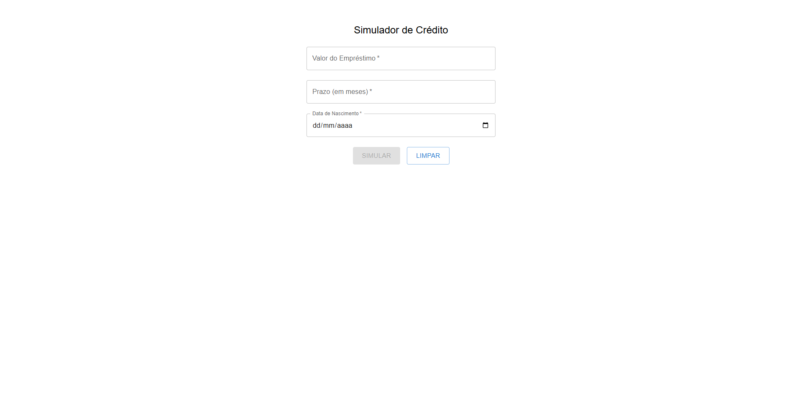
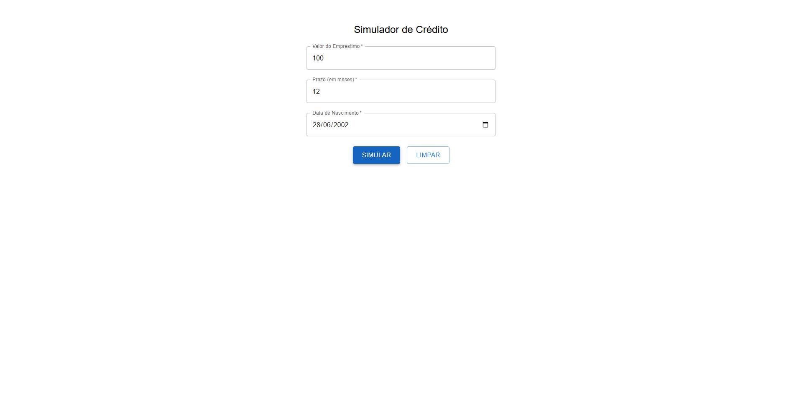
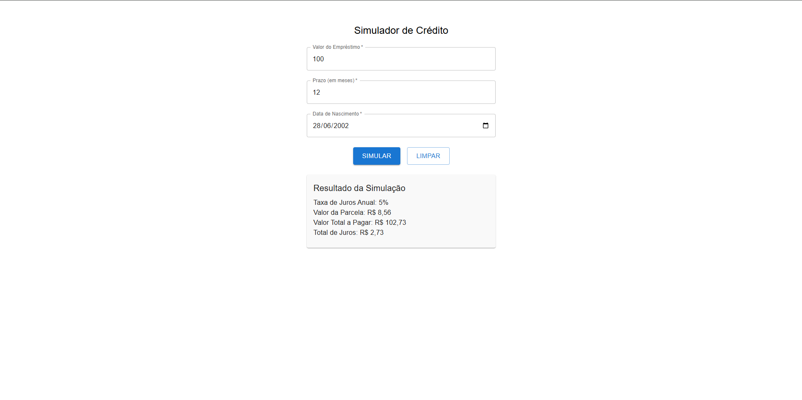

## Sobre ✔️

Desafio de Frontend para processo seletivo, Simulação de Crédito.

---

## Tecnologias Utilizadas 📎

Esse projeto foi desenvolvido com as seguintes tecnologias:

- [React com Vite](https://react.dev/learn/build-a-react-app-from-scratch)
- [TypeScript](https://www.typescriptlang.org/docs/)
- [Sass](https://sass-lang.com/)
- [Jest](https://testing-library.com/docs/react-testing-library/intro/)
- [Material UI](https://mui.com/material-ui/)

---

## Pré-requisitos 📝

Para rodar este projeto é necessário ter instalado na sua máquina as seguintes tecnologias:

- É necessário possuir o [Node.js](https://nodejs.org/en/) instalado na máquina.
- Também, é preciso ter um gerenciador de pacotes [Npm](https://www.npmjs.com/).

## Para rodar o projeto 📌

1. Escolher o emulador da sua preferência.
2. Instale as dependências: `npm install`
3. Startar a aplicação: `npm run dev`

## Resultado 📷

<h1 align="center">
    
    
    
</h1>
